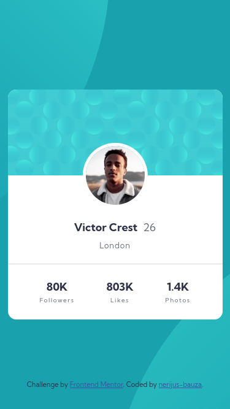
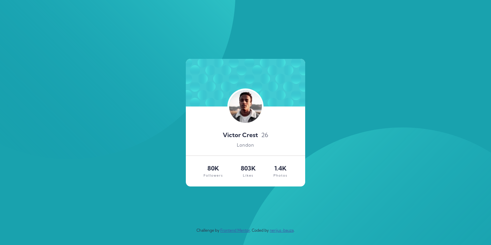

# Frontend Mentor - Profile card component solution

This is a solution to the [Profile card component challenge on Frontend Mentor](https://www.frontendmentor.io/challenges/profile-card-component-cfArpWshJ). Frontend Mentor challenges help you improve your coding skills by building realistic projects. 

## Table of contents

- [Overview](#overview)
  - [The challenge](#the-challenge)
  - [Screenshot](#screenshot)
  - [Links](#links)
- [My process](#my-process)
  - [Built with](#built-with)
  - [What I learned](#what-i-learned)  
  - [Useful resources](#useful-resources)
- [Author](#author)

## Overview

### The challenge

- Build out the project to the designs provided

### Screenshot

- Mobile preview 375x667:<br>


- Desktop preview 1440x720:<br>


### Links

- Solution URL: [Github Repo](https://github.com/nerijus-bauza/fm-challenges-new_profile-card-component)
- Live Site URL: [Github pages](https://nerijus-bauza.github.io/fm-challenges-new_profile-card-component/)

## My process

### Built with

- Semantic HTML5 markup
- CSS custom properties
- Flexbox
- Mobile-first workflow

### What I learned

- I learned how to add, position and style multiple background images.
```css
body {  
  background-color: var(--bg-main);
  background-image: url('./images/bg-pattern-top.svg'), url('./images/bg-pattern-bottom.svg');
  background-repeat: no-repeat, no-repeat;
  background-position: right 45vw bottom 60vh, left 45vw top 54vh;
  background-size: 600px, 600px;
}
```
- I also learned how to use PerfectPixel Chrome addon for comparing design image with website. The site I've made is not pixel perfect, but at least I've tried :)

### Useful resources

- [Using multiple backgrounds on MDN](https://developer.mozilla.org/en-US/docs/Web/CSS/CSS_Backgrounds_and_Borders/Using_multiple_backgrounds) - How to use multiple backgrounds.
- [PerfectPixel Chrome addon](https://www.welldonecode.com/perfectpixel/)

## Author

- Github - [nerijus-bauza](https://github.com/nerijus-bauza)
- Frontend Mentor - [@nerijus-bauza](https://www.frontendmentor.io/profile/nerijus-bauza)